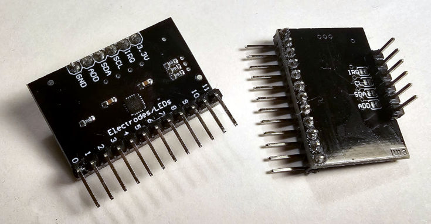

# Toit Driver library for the MPR121 Touch/Proximity sensor
This is a Toit driver for the MPR121 is a capacitive touch sensor controller,
made by NXP Semiconductors.  It detects when a finger (or any conductive object)
approaches or touches one of the pads.

## Status: INCOMPLETE
> [!WARNING]
> Still under development.  Features unlikely to work.

## Overview

## Quickstart

## Features
The MPR121 uses a constant DC current capacitance sensing scheme. It can measure
capacitances ranging from 10 pF to over 2000 pF with a resolution up to 0.01 pF.
The device does this by varying the amount of charge current and charge time
applied to the sensing inputs.

## Not Yet Implemented
At this time:
- GPIO function has not been implemented.
- LED driver function has not yet been implemented.

## Issues
If there are any issues, changes, or any other kind of feedback, please
[raise an issue](toit-mpr121/issues). Feedback is welcome and appreciated!

## Disclaimer
- This driver has been written and tested with an unbranded INA226 module.
- All trademarks belong to their respective owners.
- No warranties for this work, express or implied.

## Credits
- Several works were pivotal in understanding the device and how it works.
  - [Janelia Arduino Driver](https://github.com/janelia-arduino/MPR121)
  - [Bare Conductive Arduino Driver](https://github.com/BareConductive/mpr121)
  - [Adafruit Driver](https://github.com/adafruit/Adafruit_MPR121/)
- [Florian](https://github.com/floitsch) for the tireless help and encouragement
- The wider Toit developer team (past and present) for a truly excellent product
- AI has been used for code and text reviews, analysing and compiling data and
  results, and assisting with ensuring accuracy.

## About Toit
One would assume you are here because you know what Toit is.  If you dont:
> Toit is a high-level, memory-safe language, with container/VM technology built
> specifically for microcontrollers (not a desktop language port). It gives fast
> iteration (live reloads over Wi-Fi in seconds), robust serviceability, and
> performance that’s far closer to C than typical scripting options on the
> ESP32. [[link](https://toitlang.org/)]
- [Review on Soracom](https://soracom.io/blog/internet-of-microcontrollers-made-easy-with-toit-x-soracom/)
- [Review on eeJournal](https://www.eejournal.com/article/its-time-to-get-toit)
